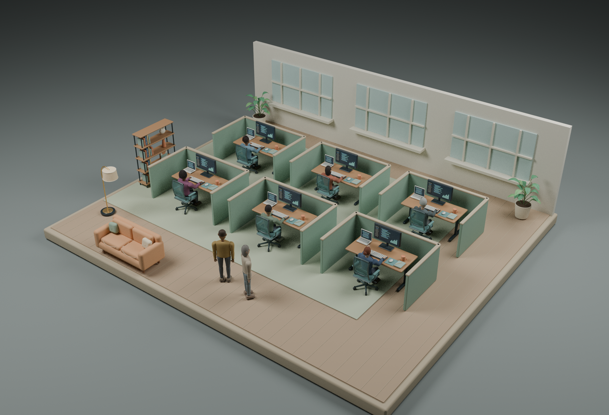

# Pi Office

A full-window, local 3D office for your Pi coding agents. Each participating session gets an airy cubicle section. Original modeled furniture and articulated residents bring the office to life; live state, task, current tool, model, reported usage and activity remain available when you select an agent.

**View-only MVP. Native Windows runtime. No cloud account, telemetry, external fonts or remote assets.** The initial view is live and empty until you connect a session. Demo mode is explicitly labeled sample data and never mixed with live data.

Existing installation? See [UPDATING.md](UPDATING.md) to preserve your token and extension path while applying the 0.4.0 resident and navigation update.

## Windows quick start

If you cloned the Git repository, run `npm ci` and `npm run build` in the repository first. The generated `dist/` directory is not committed. Then use `npm start` or `START-OFFICE.cmd`. The no-build shortcut below applies only to a release ZIP that includes `dist/`.

Install a supported Node.js LTS release (22.20 or newer; Node 24 recommended) from https://nodejs.org/. Keep Pi installed and updated using its own official installation instructions. This app does not install, update or pin Pi.

The ZIP includes a prebuilt browser bundle. For the simplest start, double-click `START-OFFICE.cmd` after installing Node.js, then open the local URL it prints. This needs no npm install. To connect a Pi session, open PowerShell in your project folder and run `& 'C:\Users\you\pi-office\CONNECT-PI.cmd'`. Adjust the path to where you extracted the app. The launcher passes through extra Pi arguments and does not change your project directory. These Windows launchers are provided for convenience and have not been executed on Windows here.

For a source build, or to follow every step explicitly:

1. Extract this folder somewhere private, such as `C:\Users\you\pi-office`. Open PowerShell there.
2. Run:

   ```powershell
   npm install
   npm run build
   npm start
   ```

3. Open **http://127.0.0.1:4317** in Edge, Chrome or Firefox. Keep that PowerShell window open. Hardware acceleration/WebGL is needed for the 3D room. The agent list and details have a fallback if WebGL fails.
4. In **each separate PowerShell window where you launch Pi**, load the local observer explicitly. Set `$Office` to your extracted folder:

   ```powershell
   $Office = 'C:\Users\you\pi-office'
   $env:PI_OFFICE_TOKEN_FILE = Join-Path $Office '.pi-office-token'
   $env:PI_OFFICE_URL = 'http://127.0.0.1:4317'
   pi -e "$Office\extension\pi-office.ts"
   ```

   Change into your project directory before running `pi`, as usual. The observer does not change that working directory. It loads only for this invocation; no extension is silently copied into your global Pi configuration. Close/relaunch existing Pi sessions with this option to include them.

5. Switch to **Live sessions** in the office. Every session launched this way joins automatically. When compatible pi-subagents observability is available, child agents appear within their parent session.

The `.pi-office-token` file is generated on the first bridge start and is never displayed in the browser. Keep the app folder private to your Windows account, with normal Windows user-folder ACLs. Do not put it in a public shared folder or commit the token. If you override `PI_OFFICE_TOKEN` for the bridge, supply the same value to each observer instead of reading the generated file. Never paste it into chat or a URL.

### Stop and restart

Press Ctrl+C in the bridge PowerShell window. Pi continues normally. Restart with `npm start`; connected observers retry and republish their latest state. The bridge keeps observations only in memory, so old disconnected sessions disappear on restart. The local token file persists. Close the browser whenever you like; observing does not depend on a tab being open.

### Port conflict

Before starting the bridge, run `$env:PI_OFFICE_PORT = '4318'`, then `npm start`. Open the URL printed by the bridge and set `PI_OFFICE_URL` to that URL in all Pi shells. Only plain HTTP on `127.0.0.1` or `localhost` is accepted. Do not expose the port through a tunnel or reverse proxy.

## Using the office

- The scene fills the window. Agent rosters and details start closed.
- Click a character, or choose one from the small Agents button, to open its context controls.
- Inspect opens its actual task/state/tool/model/usage/activity. Wave and Take a walk are visual interactions only. They never send Pi a prompt or change an agent's real work.
- A stroll follows a desk-to-lounge route and returns automatically. The back-arrow returns early. Walkers queue per room to avoid opposing traffic in the aisle.
- Focus frames a selected resident once; Follow tracks them until you take control. Dragging, scrolling, keyboard navigation, Escape, or Reset camera cancels tracking.
- Drag to orbit, scroll to zoom, right-drag to pan. Focus the office canvas to use WASD/arrow keys; the help button lists keyboard and touch controls. Camera movement stays within the office. Fullscreen is optional.
- Eight original adult resident models have distinct facial structure, hair, skin tones, stature and outfits. Appearance is assigned from agent ID, so selecting, reordering, switching rooms or changing task/state never rerolls it. These are visual identities, unrelated to roles or real people.
- The styled project selector focuses a session or shows the first four sections. Each section shows up to six desks for performance. Every retained agent remains accessible in the roster; selecting an overflow agent brings its desk into view.
- Work types; thinking, waiting, idle, error, completion and offline states have distinct restrained poses. Completion reacts once and settles. These reflect reported state, not an inferred task result.
- OS reduced-motion preference freezes ambient/state gestures. Requested moves change location without an animated traverse, and camera following moves without easing.
- Low 1.15 m partitions define roomy open-front cubicles. Clear row and side aisles exceed 1.2 m; routes are tested against tables, chairs and every partition.
- Live is the default. Explore demo uses clearly labeled sample agents; demo values never mix with actual sessions.
- Activity bubbles stay a fixed screen size: state/tool/task nearby, a compact marker in the overview, and hidden at far distances. Hover or keyboard-focus one for task, tool, model and observation freshness. Click/tap selects the agent; Escape or an outside click dismisses the hover details.

### Connect already-open Pi sessions without a special launcher

Keep the observer in its extracted app folder. In your Pi user settings (`%USERPROFILE%\.pi\agent\settings.json`, unless your agent directory is customized), append the absolute path to `extension/pi-office.ts` to the existing `extensions` array, preserving other entries. Use forward slashes in JSON, for example:

```json
{ "extensions": ["C:/Users/you/pi-office/extension/pi-office.ts"] }
```

Start the bridge first, then run `/reload` in each open interactive Pi session **when its response, compaction and subagent work are idle**. Future ordinary Pi launches load the observer automatically. This uses the default bridge port and the local token beside the app; no new environment variables are required. Pi versions started with extensions disabled may not discover it. Moving the observer alone to a different directory changes its relative token lookup, so keep the original path.

Reload replaces Pi's extension runtimes. It is not invisible mid-task attachment. Historical activity is not fully reconstructed; observation starts when loaded. See the [official resource settings](https://github.com/earendil-works/pi/blob/main/packages/coding-agent/docs/settings.md#resources) and [reload configuration guidance](https://github.com/earendil-works/pi/blob/main/packages/coding-agent/docs/configuration.md).

## What “all agents” means

“All” means **all participating Pi sessions and their observable subagents on this computer**, not arbitrary processes on Windows. Sessions that do not load the observer cannot appear. There is no process enumeration, transcript-file scraping, hidden access to another user account, or ability to attach to an existing session without loading the extension.

Set `$env:PI_OFFICE_INCLUDE_TASKS = '0'` before starting Pi to hide task previews.

The observer uses Pi's documented extension lifecycle and read-only event bus. It negotiates optional pi-subagents observability and uses available status/fleet fields. If an API or field is missing, the app retains root-session observation and reports missing values as unavailable. It does not infer precise cost/token counts from text. The current public fleet DTO provides child names/models/tokens but can omit current tools, per-child cost, and terminal outcomes. Opaque fleet keys are never guessed to be run IDs. Some synchronous subagent tools may expose activity as parent tool observations without independent live child rows.

## Architecture

```
Pi session + explicit observer extension
  └─ localhost authenticated HTTP observations ──> Node bridge
      └─ bounded in-memory snapshot + same-origin SSE ──> local browser
                                                          React + Three.js office
```

- `extension/pi-office.ts`: read-only Pi event observer; no companion npm dependency and no version-specific Pi import. Works through capability checks and structural fields.
- `bridge/server.mjs`: Node built-ins only; binds IPv4 loopback, authenticates ingestion and serves the production bundle.
- `bridge/state.mjs`: bounded normalized snapshots, retention and stale/offline projection.
- `src/`: React 19 + React Three Fiber / Three.js, perspective room world, collision-safe visual routes and camera following.
- `public/models/`: original local furniture GLBs and eight resident variants, embedded materials and eleven complete articulated character animation clips.
- `assets-source/`: original Blender generation/export scripts and compressed editable `.blend` scenes.
- `asset-renders/`: inspected Blender previews, clearly distinct from browser screenshots.
- `test/backend*.test.mjs`: protocol, state, origin/auth/static serving, SSE and actual observer lifecycle/RPC contract tests.
- `test/ui.spec.ts`: repeatable browser interaction checks (run separately with Playwright).

The observer-to-bridge protocol has its own schema version, currently 1. This is independent of the installed Pi version. Updating Pi does not require matching a hardcoded version string. Structural event/API changes can still require adapter updates; unsupported information is not fabricated. The project lockfile pins the tested UI dependency tree for reproducible installs, not the Pi runtime.

## Security and data boundaries

- The bridge binds `127.0.0.1` only and rejects unexpected Host, Origin and cross-site fetches. No CORS wildcard, remote binding or agent-control endpoint.
- Both capability handshake and observation POSTs require a long local bearer token. Browser GETs are same-origin and do not expose that token.
- Content Security Policy limits production assets and connections to this origin. No telemetry, CDN, external model/font assets, analytics or cloud transmission is part of the app.
- Task prompts, local paths, names and status can be sensitive. They are displayed to local browser tabs that can reach the bridge. This is not a security boundary against other software already running as you or another locally privileged user.
- Task text and observation logs are bounded in memory. The observer does not capture raw tool arguments/output, API keys or assistant private reasoning. Root task text can still include secrets if you include them in your prompt; use a trusted machine and do not screen-share confidential tasks.
- The app cannot start/stop agents, approve tools, send prompts, edit files, modify models or perform any Pi action. All real work remains in Pi.
- An idle browser or network disconnect does not change Pi behavior. Stale/offline is an observation state, not proof that a task failed. A missing child is not assumed successful.
- npm installation contacts the official package registry; Pi itself may contact its configured model provider as usual. The running office app adds no external data transmission.

## Development and validation

```powershell
npm ci
npm run check
```

For local UI development, run `npm start` in one terminal and `npm run dev` in another. Prefer production `npm run build` + `npm start` for normal use. The development server is loopback-only; the production bridge security checks are authoritative.

Browser tests require Playwright's Chromium browser (`npx playwright install chromium`) or an existing Chromium supplied through `PLAYWRIGHT_CHROMIUM_EXECUTABLE_PATH`:

```powershell
npx playwright test
```

See `TESTING.md` for the exact checks actually executed and the untested boundaries. No Windows or real-Pi-runtime test is claimed unless explicitly recorded there.

## Troubleshooting

**No sessions:** Confirm `npm start` is still running, the URL/port matches, and each Pi process was explicitly started with `-e` and the same local token file or token environment variable. The demo proves the UI works, not that observation is configured.

**Root appears but children do not:** Ensure the installed pi-subagents extension exposes compatible observability. The observer never invokes task-control RPCs to make a child appear. Check the optional capability fields in the local snapshot or the observer's single reconnect/compatibility warning in Pi.

**Unavailable model/usage/cost:** The current session or extension did not report that field. This is deliberately shown as unavailable; it is not zero usage.

**Stale/offline:** The latest heartbeat is old. The observer retries automatically while Pi is running. Closed sessions remain in the bounded in-memory history until evicted by newer sessions or the bridge restarts. Active rows become stale after 35 seconds and offline after 120 seconds without a heartbeat.

**Blank room:** Enable hardware acceleration, update your browser and check WebGL. Agent selection/detail still works without the scene.

**Address already in use:** Stop the existing bridge or choose a different port with the environment variables above.

## References

- Pi extension API: https://github.com/earendil-works/pi/blob/main/packages/coding-agent/docs/extensions.md
- pi-subagents observability: https://github.com/nicobailon/pi-subagents/blob/main/docs/observability.md
- pi-subagents extension API: https://github.com/nicobailon/pi-subagents/blob/main/docs/extension-api.md

Built as a view-only Pi observer with visual character interactions. Actual agent-control features would need a separately designed permission model.

## Asset previews




The editable source and export scripts are included. See `assets-source/README.md`, `assets-source/resident-variants.json` and `public/models/asset-manifest.json` for dimensions, animation names and authorship. The office review uses the runtime cubicle coordinates and final GLBs, with six seated residents and two additional staged lounge residents to show all eight variants. Browser HUD, activity bubbles and camera controls are not shown: these are Blender asset renders, not application screenshots.
